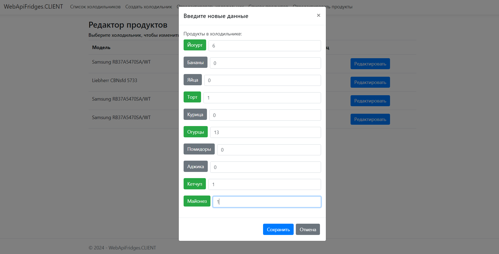

<h1 align="center">Hi there!✌️</a> 
<h3 align="center">This is a ASP.Net Core Web App developed during my training on a technical assignment, which allows you to interact with a <a href="https://github.com/MaXiMKnjsh/CLIENT-client-server-app-fridges.git">Web API</a>
<h2 align="center">🔥Keywords: ASP.Net Core Web App (MVC), JS, HTML, CSS, Bootstrap</h2>

<h3>The terms of reference:</h3>

  <h3>The result of the decision:</h3>

